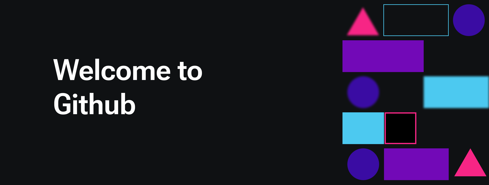

# 👋 Hello! I'm Mr. Udomkiat Phokaew (B)

Welcome to my GitHub profile! I am a student deeply interested in programming and technology. Programming is both my hobby and passion. I am always eager to learn and develop new skills.

## 🛠️ Skills and Technologies

- **Languages:** TypeScript, C, Assembly
- **Frameworks:** Next.js
- **Tools:** Git, Docker, Visual Studio Code
- **Others:** Tailwind CSS

## 🌟 Notable Projects

### Project 1: [libft](https://github.com/uphokaew/libft)
Libft is a project from my studies at 42 Bangkok, focused on creating various libraries and utility functions.

### Project 2: [ft_printf](https://github.com/uphokaew/ft_printf)
ft_printf is a project from my studies at 42 Bangkok, focused on creating various libraries and utility functions.

## 🧠 What I'm Learning

I am currently delving into low-level programming languages to gain a deeper understanding of computer operations and architecture.

## 📫 How to Reach Me

- **Email:** beok159@gmail.com
- **LinkedIn:** [Your LinkedIn Profile](https://www.linkedin.com/in/udomkiat-phokaew-78b62b167/)
- **GitHub:** [Your GitHub Profile](https://github.com/uphokaew)

Thank you for visiting my profile!
